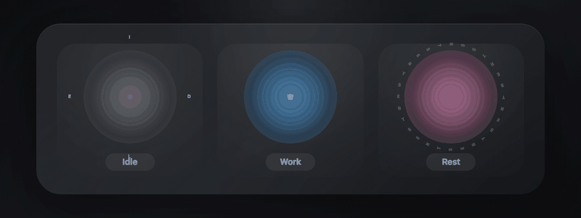

<p align="center">
  
</p>

<h1 align="center">DeskCat</h1>

<p align="center">
  A personal AI desktop companion for calm work, smarter focus, coding sessions, and your day-in-review Timeline.
</p>

<p align="center">
  让你的小猫、小狗住进桌面，陪你工作、聊天、提醒专注与休息，并自动整理你的时间线。
</p>

<p align="center">
  
  
  
  
  
</p>

<p align="center">
  <a href="#english">English</a> · <a href="#中文">中文</a>
</p>

<p align="center">
  
</p>

## English

DeskCat is an Electron app for people who want a desktop companion that is useful, personal, and a little alive. It can be your cat, dog, or any custom avatar. It stays near your work, talks with you, speaks aloud, reminds you when you drift, connects to coding agents, and turns your day into a readable Timeline.

The product is organized around four core features:

1. **Desktop companion**
2. **AI chat**
3. **Focus guard**
4. **Smart timeline**

## Core Features

### Desktop Companion

DeskCat lives on your desktop as a pet or an orb. You can use the built-in cat assets or import your own cat, dog, character, PNG frames, GIFs, and state-specific animations.

- Custom avatars for idle, work, rest, drinking, thinking, and sleeping states.
- Pet or orb display modes, opacity, size, motion, and always-on-top behavior.
- Voice output, cloud TTS, and system speech fallback so your companion can actually talk.
- Rest and water reminders shown directly around the companion, not hidden in a productivity dashboard.
- macOS-friendly floating window behavior for desktop and fullscreen spaces.

**How it works:** the companion is a transparent frameless Electron window rendered by React. Pet state is driven by local settings, focus/rest timers, chat/coding activity, and timeline sampling. Native macOS panel handling keeps the companion visible without behaving like a normal app window.

### AI Chat

DeskCat includes a compact chat next to the companion and a full chat window for longer conversations. It supports text, screenshots/images, document text extraction, voice input, and voice output.

- Built-in model path for quick start, plus custom OpenAI-compatible chat providers.
- Image and screenshot analysis through chat messages.
- PDF/DOCX upload by extracting local text before sending context to the model.
- STT/TTS for voice input and spoken replies.
- System Knowledge Base for local time, weather, device info, Calendar, and Reminders when authorized.
- Coding mode connects to **Codex** and **Claude Code** so the companion can sit beside active agent sessions.

**How it works:** chat calls go through Electron IPC. User API keys are stored through local/keychain-backed storage. Built-in chat/voice no longer ships API keys in the client: Electron calls a Supabase Edge Function proxy, while server-side secrets stay in Supabase. Requests include app version, device id, action, timestamp, nonce, and HMAC signature so the proxy can enforce rollout and reduce abuse.

### Focus Guard

Focus Guard is the part of DeskCat that notices when you said you wanted to work and then wandered somewhere else.

- Focus sessions with foreground app, window title, and browser URL matching.
- Distraction reminders for blocked apps, sites, or keywords.
- Water and rest reminders during long work blocks.
- Game/fullscreen detection to reduce interference when another app needs the screen.
- Coding mode status for Codex and Claude Code, including working/done/needs-input states.

**How it works:** the Electron main process samples foreground app/window state through macOS System Events and AppleScript, then the renderer compares normalized app/title/url data against focus rules. Coding mode reads Codex app-server events and Claude Code `stream-json` output, then maps them into compact companion states.

### Smart Timeline

Smart Timeline is DeskCat's memory of your workday. It shows where your attention went, which apps dominated your day, where distractions happened, and what was running in the background.

- Foreground activity timeline with app names, window titles, browser domains, and categories.
- Short-switch folding so tiny accidental app hops do not destroy the main work block.
- Idle pause handling so reading, thinking, or stepping away does not become fake activity.
- Background markers for coding agents, music, terminal, and other tracked context.
- 14-day focus stats, top apps, distraction ranking, active hours, and profile summaries.
- Cloud analytics/dashboard support through Supabase when enabled.

**How it works:** the local store keeps timeline entries, focus stats, conversations, settings, and telemetry under `deskcat:electron-db:v1`. `timelineRecorder.ts` manages active/candidate/paused/background states, while `timelineView.ts` clips entries across days and prepares display aggregates. Optional cloud sync sends encrypted backups and telemetry events to Supabase tables such as `devices`, `cloud_backups`, and `telemetry_events`.

## Technical Architecture

DeskCat is local-first, with cloud services used only where they make sense.

| Area | Implementation |
| --- | --- |
| Desktop shell | Electron 39, transparent frameless windows, native macOS panel behavior, Electron Builder packaging |
| UI | React 19, TypeScript, Vite 8, Tailwind CSS 4, Radix UI, lucide-react |
| Local data | Browser localStorage-backed app store for settings, conversations, Timeline, focus stats, and telemetry queue |
| Secure keys | Local/keychain-backed API key references; built-in service keys stay server-side |
| Timeline sensing | macOS System Events, AppleScript, browser/window title sampling, idle/fullscreen/game guards |
| AI chat | OpenAI-compatible chat/STT/TTS through Electron IPC; built-in calls routed through Supabase Edge Functions |
| Cloud | Supabase Edge Functions, Postgres tables, migrations, optional cloud backup and analytics dashboard |
| Coding mode | Codex app-server stdio protocol and Claude Code `stream-json` protocol |
| Updates | electron-updater with GitHub releases and `latest-mac.yml` |

## Privacy Model

- Personal data is local by default.
- Timeline and conversations are stored on the user's machine unless cloud sync is enabled.
- Built-in AI proxy usage records do **not** store prompts, replies, images, audio, or API keys.
- Supabase is used for cloud backup/analytics, public stats, and the built-in AI proxy.
- macOS permissions are requested only for features that need them: Accessibility, Automation/System Events, Calendar, Reminders, Location, Microphone, and Screen Recording.

## Install

Download the latest macOS build from [GitHub Releases](https://github.com/ppxinyue/DeskCat/releases/latest).

- Apple Silicon: `DeskCat-*-arm64.dmg`
- Intel Mac: `DeskCat-*-x64.dmg`

## Run From Source

```bash
git clone https://github.com/ppxinyue/DeskCat.git
cd DeskCat
pnpm install
pnpm electron:dev
```

Useful commands:

```bash
pnpm electron:dev        # Vite + Electron development mode
pnpm build               # TypeScript + Vite production build
pnpm electron:build:mac  # macOS x64 + arm64 DMG build
pnpm test                # Timeline, AI, chat, and startup tests
pnpm lint                # ESLint
```

## Repository Map

```text
electron/main.cjs                 Electron main process, windows, native integrations, AI proxy calls
src/App.tsx                       Desktop orchestration, companion state, Timeline sampling
src/features/pet/                 Pet/orb rendering, animation config, visual states
src/features/chat/                Chat UI, compact chat, images, documents, voice handoff
src/features/ai/                  Chat service, default model, system knowledge
src/features/voice/               STT/TTS and system speech fallback
src/lib/timelineRecorder.ts       Timeline state machine
src/lib/timelineView.ts           Timeline clipping and aggregation
src/lib/db.ts                     Local store, focus stats, telemetry, cloud sync payloads
supabase/functions/               Edge Functions for sync, dashboard, public stats, built-in AI proxy
supabase/migrations/              Supabase schema and analytics views
dashboard/                        Developer analytics dashboard
website/                          Marketing/download website
```

## 中文

DeskCat 是一个 Electron 桌面应用。它不是普通聊天窗口，而是一只住在桌面上的 AI 灵宠：可以是小猫、小狗，也可以是你自己的角色。它会陪你工作，会说话，会提醒你专注和休息，还会把一天的工作自动整理成 Timeline。

DeskCat 的核心功能分成四个：

1. **Desktop companion 桌面灵宠**
2. **AI chat 智能聊天**
3. **Focus guard 专注守卫**
4. **Smart timeline 智能时间线**

## 核心功能

### Desktop Companion 桌面灵宠

DeskCat 可以作为灵宠或悬浮球停在桌面上。你可以使用内置小猫资源，也可以换成自己的小猫、小狗、角色、PNG 帧、GIF 和不同状态动画。

- 支持 idle、work、rest、drinking、thinking、sleeping 等状态。
- 支持灵宠 / Orb 模式、透明度、大小、动效和置顶行为。
- 支持语音朗读、云端 TTS 和系统朗读兜底，让灵宠真的能说话。
- 喝水提醒、休息提醒直接显示在灵宠附近。
- 对 macOS 桌面、全屏 Space、悬浮窗层级做了专门适配。

**技术方案：** 灵宠是 React 渲染的 Electron 透明无边框窗口。状态来自本地设置、专注/休息计时器、聊天状态、Coding 状态和 Timeline 采样。macOS 下通过 native panel 行为控制全屏和置顶体验。

### AI Chat 智能聊天

DeskCat 有灵宠旁边的 compact chat，也有完整聊天窗口。它可以处理文本、截图/图片、PDF/DOCX 文档文本、语音输入和语音回复。

- 内置模型快速可用，也支持自定义 OpenAI-compatible provider。
- 支持图片、截图分析。
- 支持 PDF/DOCX 上传，本地提取文本后作为模型上下文。
- 支持 STT 语音输入和 TTS 语音回复。
- 系统知识库可在授权后读取时间、天气、设备信息、日历和提醒事项。
- Coding mode 连接 **Codex** 和 **Claude Code**，让灵宠陪着 agent 工作。

**技术方案：** 聊天请求通过 Electron IPC 进入主进程。用户自己的 API Key 使用本地/keychain-backed 存储。内置 chat/voice 不再把 key 打进客户端，而是调用 Supabase Edge Function 代理，真实 key 只在 Supabase secrets 中。客户端请求会带 app version、device id、action、timestamp、nonce 和 HMAC 签名，服务端可以做版本校验和防滥用控制。

### Focus Guard 专注守卫

Focus Guard 负责在你进入专注状态后，提醒你有没有分心。

- 专注模式会匹配当前前台 app、窗口标题和浏览器 URL。
- 可配置分心 app、网站或关键词提醒。
- 长时间工作时提醒喝水和休息。
- 检测游戏/全屏场景，减少灵宠窗口对游戏或全屏软件的干扰。
- Coding mode 会展示 Codex / Claude Code 的 working、done、needs-input 等状态。

**技术方案：** Electron 主进程通过 macOS System Events 和 AppleScript 采样前台窗口、应用、浏览器 URL、音乐和系统状态。前端把标准化后的 app/title/url 与专注规则匹配。Codex 通过 app-server stdio 协议接入，Claude Code 通过 CLI `stream-json` 输出接入。

### Smart Timeline 智能时间线

Timeline 是 DeskCat 对你一天工作状态的记忆。它会告诉你时间花在哪里，哪些 app 占据最多，什么时候分心，背景里还运行着什么。

- 记录前台 app、窗口标题、浏览器域名和分类。
- 折叠很短的切换，避免 1-2 秒误触破坏主时间块。
- 处理 idle / 暂停状态，避免把离开电脑当成有效工作。
- 记录 Coding、音乐、终端等背景 marker。
- 展示 14 天专注统计、Top apps、分心排行、活跃时段和个人档案。
- 开启云端能力后，可通过 Supabase 做备份、统计和 dashboard。

**技术方案：** 本地数据存在 `deskcat:electron-db:v1`，包括 settings、conversations、timeline entries、focus stats 和 telemetry queue。`timelineRecorder.ts` 负责 active/candidate/paused/background 状态机，`timelineView.ts` 负责跨日裁剪、色块展示和统计聚合。可选云同步会把加密备份与 telemetry 发送到 Supabase 的 `devices`、`cloud_backups`、`telemetry_events` 等表。

## 技术架构

DeskCat 是 local-first 应用，云端只用于需要云端能力的地方。

| 模块 | 技术方案 |
| --- | --- |
| 桌面壳 | Electron 39、透明无边框窗口、macOS native panel、Electron Builder |
| 前端 | React 19、TypeScript、Vite 8、Tailwind CSS 4、Radix UI、lucide-react |
| 本地数据 | localStorage-backed store，保存设置、聊天、Timeline、专注统计和 telemetry 队列 |
| 密钥安全 | 用户 API key 使用本地/keychain-backed 引用；内置服务 key 只在服务端 |
| Timeline 感知 | macOS System Events、AppleScript、窗口标题/浏览器 URL 采样、idle/fullscreen/game 保护 |
| AI 能力 | OpenAI-compatible chat/STT/TTS，经 Electron IPC 调用；内置服务经 Supabase Edge Function 代理 |
| 云端 | Supabase Edge Functions、Postgres migrations、可选云备份、统计 dashboard |
| Coding mode | Codex app-server stdio 协议、Claude Code `stream-json` 协议 |
| 自动更新 | electron-updater、GitHub Releases、`latest-mac.yml` |

## 隐私模型

- 默认本地优先，个人数据先留在用户机器上。
- Timeline 和聊天记录不会自动上传，除非用户开启云同步。
- 内置 AI 代理的用量记录不保存 prompt、回复正文、图片、音频或 API key。
- Supabase 用于云备份/统计、公开下载统计和内置 AI 代理。
- macOS 权限按功能触发：辅助功能、Automation/System Events、日历、提醒事项、位置、麦克风、屏幕录制。

## 安装

从 [GitHub Releases](https://github.com/ppxinyue/DeskCat/releases/latest) 下载最新版。

- Apple Silicon：`DeskCat-*-arm64.dmg`
- Intel Mac：`DeskCat-*-x64.dmg`

## 本地运行

```bash
git clone https://github.com/ppxinyue/DeskCat.git
cd DeskCat
pnpm install
pnpm electron:dev
```

常用命令：

```bash
pnpm electron:dev        # Vite + Electron 开发模式
pnpm build               # TypeScript + Vite 生产构建
pnpm electron:build:mac  # macOS x64 + arm64 DMG 构建
pnpm test                # Timeline、AI、Chat、启动生命周期测试
pnpm lint                # ESLint
```

## 目录结构

```text
electron/main.cjs                 Electron 主进程、窗口、原生集成、AI proxy 调用
src/App.tsx                       桌面交互编排、灵宠状态、Timeline 采样
src/features/pet/                 灵宠/Orb 渲染、动画配置、视觉状态
src/features/chat/                Chat UI、compact chat、图片、文档、语音交接
src/features/ai/                  Chat service、默认模型、系统知识库
src/features/voice/               STT/TTS、系统语音兜底
src/lib/timelineRecorder.ts       Timeline 状态机
src/lib/timelineView.ts           Timeline 裁剪和聚合
src/lib/db.ts                     本地 store、专注统计、telemetry、云同步 payload
supabase/functions/               同步、dashboard、公开统计、内置 AI proxy 的 Edge Functions
supabase/migrations/              Supabase schema 和 analytics views
dashboard/                        开发者数据 dashboard
website/                          官网/下载页
```
