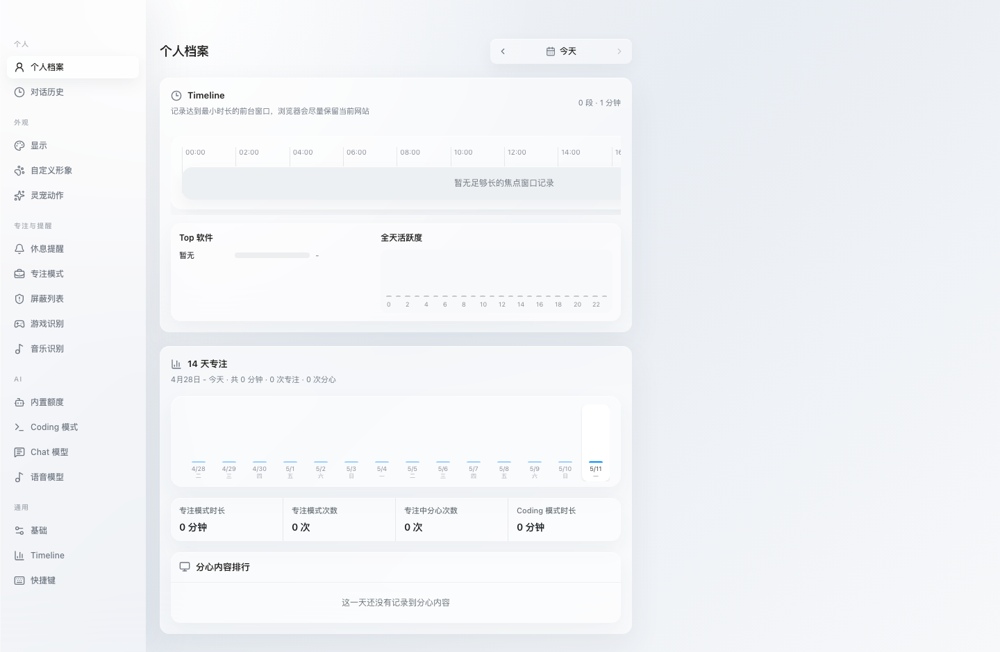
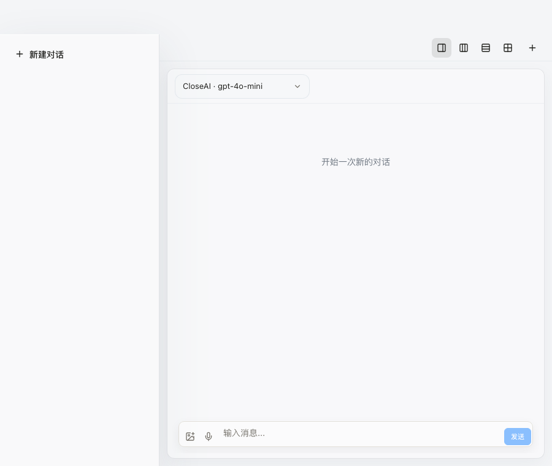

<p align="center">
  
</p>

<h1 align="center">cat15 猫十五</h1>

<p align="center">
  一只住在桌面上的 AI 灵宠，帮你聊天、专注、记录 Timeline，并在 Coding 时陪你工作。
</p>

<p align="center">
  An AI desktop companion for chat, focus, Timeline tracking, and coding workflows.
</p>

<p align="center">
  
  
  
  
</p>

<p align="center">
  <a href="#中文">中文</a> · <a href="#english">English</a>
</p>

<p align="center">
  
</p>

## 中文

cat15 猫十五是一个 Electron 桌面应用。它可以以灵宠或悬浮球的形式停在屏幕上，提供 AI 对话、语音输入、截图输入、专注提醒、分心检测、Timeline 记录、Coding 模式和个人统计。它的设计目标是本地优先、低打扰、可定制，并尽量贴近 macOS 的轻量玻璃质感。

## 功能

| 功能 | 技术方案 |
| --- | --- |
| **Pet / Orb 模式** | Electron 透明无边框窗口 + React 渲染；Pet 使用 PNG/GIF 资源，Orb 使用 CSS/React 绘制。 |
| **深色 / 浅色主题** | 主题设置保存在本地；启动阶段预置主题 class，避免窗口先浅后深闪烁。 |
| **AI 对话** | 小聊天框和大聊天窗口共用 React 组件；模型配置支持 OpenAI-compatible Base URL、Model、API Key。 |
| **图片与截图输入** | Renderer 触发文件选择或截图请求，主进程通过 IPC 调用桌面能力并回传结果。 |
| **语音输入** | Web Audio 采集音量并驱动实时波形；STT/TTS 通过可配置模型服务处理。 |
| **Coding 模式：Codex** | 主进程启动 `codex app-server --listen stdio://`，使用换行 JSON / JSON-RPC-like 消息调用 `thread/start`、`thread/resume`、`turn/start`。 |
| **Coding 模式：Claude Code** | 调用 `claude -p --output-format stream-json --verbose`，按行解析 stream-json，并用 `--resume <sessionId>` 延续会话。 |
| **Coding 历史继承** | 读取 `~/.codex/sessions/**/*.jsonl` 与 `~/.claude/projects/**/*.jsonl`，解析最近会话、工具调用、错误和等待输入状态。 |
| **Timeline 记录** | macOS 通过 AppleScript/System Events 读取前台 app、窗口标题和浏览器 URL；状态机位于 `src/lib/timelineRecorder.ts`。 |
| **短暂切换折叠** | 未达到 Timeline 最小时长的 app 切换会作为 `short-foreground` marker 记录，不会打碎主活动色块。 |
| **跨日 Timeline** | 展示层在 `src/lib/timelineView.ts` 按日期裁剪片段，23:51-00:45 会正确拆到两天。 |
| **后台进程** | 主进程用 `ps` 快照识别 `pnpm`、`node`、`python`、`cargo`、`claude`、`codex` 等开发命令。 |
| **音乐识别** | Apple Music / Spotify 通过 AppleScript 读取播放状态；NeteaseMusic 使用本地播放状态缓存与时效判断。 |
| **专注模式** | 根据 app、窗口标题和浏览器 URL 匹配屏蔽应用/关键词，命中后触发分心提醒并进入统计。 |
| **游戏保护** | 用户可维护游戏识别列表；命中游戏时自动取消置顶并暂停 Timeline 刷新，减少性能影响。 |
| **个人档案** | 本地数据库聚合 Timeline、专注时长、分心内容排行、Top 软件和全天活跃度。 |
| **中英双语** | 设置项、个人档案、对话和主要 UI 文案支持中文 / English 切换。 |
| **本地优先** | 设置、Timeline、对话历史和统计数据保存在本地；只有用户主动调用模型服务时才发送输入。 |

## 界面预览

<p align="center">
  
</p>

## 安装与运行

目前建议从源码运行，需要 Node.js 与 pnpm。

```bash
git clone https://github.com/ppxinyue/DeskSprite.git
cd DeskSprite
pnpm install
pnpm electron:dev
```

macOS 首次使用 Timeline、浏览器 URL、音乐状态或截图功能时，系统可能请求 Accessibility、Automation 或 Screen Recording 权限。

## 常用命令

```bash
pnpm electron:dev   # Vite + Electron 开发模式
pnpm build          # TypeScript + Vite 构建
pnpm electron:build # 构建桌面安装包
pnpm test           # Timeline 与启动生命周期测试
pnpm lint           # ESLint
```

## 技术栈

- Electron 39 + Electron Builder
- React 19 + TypeScript + Vite 8
- Tailwind CSS 4 + Radix UI + lucide-react
- Zustand 本地状态管理
- Node.js IPC、AppleScript、macOS System Events
- OpenAI-compatible Chat / STT / TTS 配置
- Codex app-server stdio 协议、Claude Code stream-json 协议

## 项目结构

```text
electron/
  main.cjs              主进程：窗口、Timeline、音乐/游戏识别、Coding IPC
  preload.cjs           Renderer 安全桥接层
src/
  App.tsx               桌面交互编排、Timeline 采样、窗口状态
  features/chat/        聊天 UI、图片/截图/语音输入
  features/pet/         Pet / Orb 渲染、动画和悬浮状态
  features/settings/    设置 UI、模型配置、语言与主题
  lib/timelineRecorder.ts Timeline 记录状态机
  lib/timelineView.ts     Timeline 展示、裁剪与聚合
  lib/db.ts               本地持久化
public/assets/          灵宠图片、GIF 与静态资源
docs/                   README 截图与开发文档
```

## 平台状态

- **macOS**：主要开发平台，Timeline、音乐状态、全屏悬浮和浏览器 URL 检测最完整。
- **Windows**：已有 Electron Builder 配置，深度桌面感知能力仍需要平台适配。

## English

cat15 is an Electron desktop app. It lives on your screen as either a pet or an orb and provides AI chat, voice input, screenshot input, focus reminders, distraction detection, Timeline tracking, coding mode, and personal analytics. It is designed to be local-first, low-interruption, customizable, and visually close to a lightweight macOS glass interface.

## Features

| Feature | Technical approach |
| --- | --- |
| **Pet / Orb modes** | Transparent frameless Electron window + React rendering; Pet uses PNG/GIF assets, Orb is drawn with CSS/React. |
| **Light / dark themes** | Theme settings are stored locally; startup pre-paints the theme class to avoid light-to-dark flashing. |
| **AI chat** | Compact and expanded chat windows share React components; custom models use OpenAI-compatible Base URL, Model, and API Key. |
| **Image and screenshot input** | Renderer requests file picking or screenshots; the Electron main process performs desktop operations through IPC. |
| **Voice input** | Web Audio drives a live waveform; STT/TTS are handled through configurable model providers. |
| **Coding mode: Codex** | The main process starts `codex app-server --listen stdio://` and uses newline-delimited JSON / JSON-RPC-like calls such as `thread/start`, `thread/resume`, and `turn/start`. |
| **Coding mode: Claude Code** | Runs `claude -p --output-format stream-json --verbose`, parses line-delimited stream JSON, and continues sessions with `--resume <sessionId>`. |
| **Inherited coding sessions** | Reads `~/.codex/sessions/**/*.jsonl` and `~/.claude/projects/**/*.jsonl` to infer recent sessions, tool calls, errors, and input-needed states. |
| **Timeline tracking** | On macOS, AppleScript/System Events capture foreground app, window title, and browser URL; the state machine lives in `src/lib/timelineRecorder.ts`. |
| **Short-switch folding** | App switches shorter than the Timeline minimum duration are stored as `short-foreground` markers instead of splitting the main block. |
| **Cross-day Timeline** | `src/lib/timelineView.ts` clips entries by date, so a 23:51-00:45 session renders correctly across two days. |
| **Background processes** | The main process snapshots `ps` output and recognizes coding commands such as `pnpm`, `node`, `python`, `cargo`, `claude`, and `codex`. |
| **Music detection** | Apple Music / Spotify use AppleScript playback state; NeteaseMusic uses local playback cache freshness checks. |
| **Focus mode** | Blocked apps and keywords are matched against app names, window titles, and browser URLs; matches trigger reminders and statistics. |
| **Game protection** | A user-editable game list suppresses always-on-top behavior and pauses Timeline refresh to protect game performance. |
| **Profile analytics** | Local data powers Timeline, focus duration, distraction ranking, top apps, and daily activity charts. |
| **Chinese / English UI** | Main settings, profile, chat, and desktop UI copy support Chinese and English. |
| **Local-first data** | Settings, Timeline entries, chat history, and analytics stay local unless the user calls a configured model provider. |

## Preview

<p align="center">
  
</p>

## Install from source

Node.js and pnpm are required.

```bash
git clone https://github.com/ppxinyue/DeskSprite.git
cd DeskSprite
pnpm install
pnpm electron:dev
```

On macOS, Timeline tracking, browser URL capture, music state, and screenshots may ask for Accessibility, Automation, or Screen Recording permissions.

## Commands

```bash
pnpm electron:dev   # Vite + Electron dev mode
pnpm build          # TypeScript + Vite build
pnpm electron:build # desktop package build
pnpm test           # Timeline and startup lifecycle tests
pnpm lint           # ESLint
```

## Stack

- Electron 39 + Electron Builder
- React 19 + TypeScript + Vite 8
- Tailwind CSS 4 + Radix UI + lucide-react
- Zustand for local state
- Node.js IPC, AppleScript, macOS System Events
- OpenAI-compatible Chat / STT / TTS configuration
- Codex app-server stdio protocol, Claude Code stream-json protocol

## License

License not specified yet.
