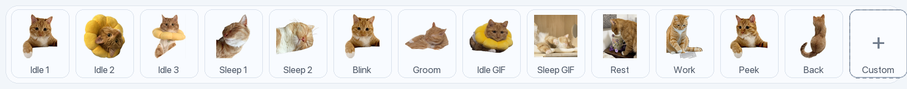
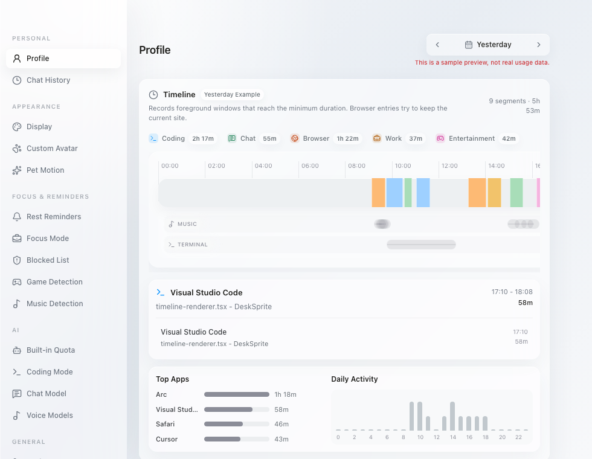
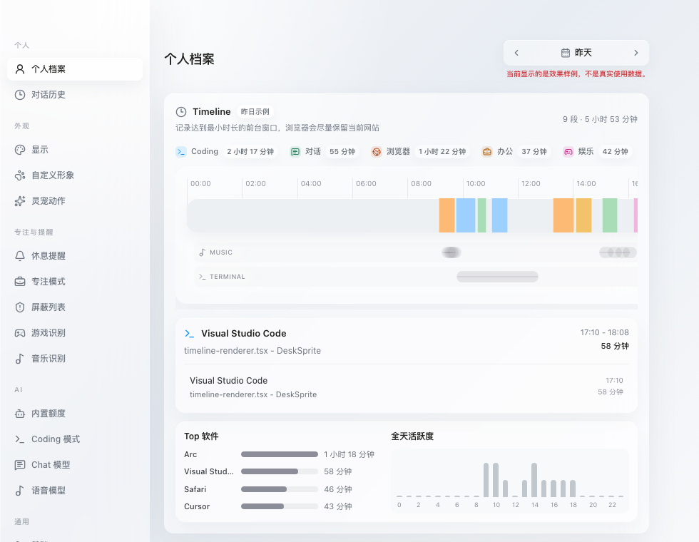

<p align="center">
  
</p>

<h1 align="center">cat15 猫十五</h1>

<p align="center">
  An AI desktop companion for chat, focus, Timeline tracking, and coding workflows.
</p>

<p align="center">
  一只住在桌面上的 AI 灵宠，帮你聊天、专注、记录 Timeline，并在 Coding 时陪你工作。
</p>

<p align="center">
  
  
  
  
</p>

<p align="center">
  <a href="#english">English</a> · <a href="#中文">中文</a>
</p>

<p align="center">
  
</p>
<p align="center">
  <sub>Orb mode preview: idle, work, and rest states with dark glass styling.</sub>
</p>

## English

cat15 is an Electron desktop app. It lives on your screen as either a pet or an orb and provides AI chat, focus reminders, Timeline tracking, coding mode, and personal analytics. It is designed to be local-first, low-interruption, customizable, and visually close to a lightweight macOS glass interface.

## Features

### Personal

<table>
  <thead>
    <tr>
      <th align="left">Setting</th>
      <th align="left">Feature</th>
      <th align="left">Technical approach</th>
    </tr>
  </thead>
  <tbody>
    <tr>
      <td align="left" nowrap><strong>Profile</strong></td>
      <td align="left">Shows Timeline, 14-day focus, top apps, daily activity, and distraction content ranking.</td>
      <td align="left">Local database aggregation; <code>timelineView.ts</code> handles cross-day clipping, color-block spans, short-use folding, and display stats.</td>
    </tr>
    <tr>
      <td align="left" nowrap><strong>Conversation History</strong></td>
      <td align="left">Opens previous chat and coding conversations.</td>
      <td align="left">Messages are persisted locally and restored by conversation id; coding history can open the latest session by default.</td>
    </tr>
  </tbody>
</table>

### Appearance

<table>
  <thead>
    <tr>
      <th align="left">Setting</th>
      <th align="left">Feature</th>
      <th align="left">Technical approach</th>
    </tr>
  </thead>
  <tbody>
    <tr>
      <td align="left" nowrap><strong>Display</strong></td>
      <td align="left">Switches Pet / Orb, theme, opacity, scale, chat width, and always-on-top behavior.</td>
      <td align="left">Transparent frameless Electron window + React state; startup pre-paints theme classes to avoid dark-mode flashing.</td>
    </tr>
    <tr>
      <td align="left" nowrap><strong>Custom Avatar</strong></td>
      <td align="left">Configures built-in or user-uploaded cat PNG/GIF assets.</td>
      <td align="left"><code>DEFAULT_MEDIA_CONFIG</code> maps idle, work, rest, and preset media; GIF mode does not stack extra motion effects.</td>
    </tr>
    <tr>
      <td align="left" nowrap><strong>Pet Motion</strong></td>
      <td align="left">Controls jump, wobble, and breathing effects.</td>
      <td align="left"><code>PetAvatar</code> and CSS animations compose motion by state; Orb uses code-rendered glass, letters, and hover motion.</td>
    </tr>
  </tbody>
</table>

<p align="center">
  
</p>
<p align="center">
  <sub>Built-in cat15 avatar resources, plus a custom slot for user-added avatars.</sub>
</p>

### Focus & Reminders

<table>
  <thead>
    <tr>
      <th align="left">Setting</th>
      <th align="left">Feature</th>
      <th align="left">Technical approach</th>
    </tr>
  </thead>
  <tbody>
    <tr>
      <td align="left" nowrap><strong>Rest Reminder</strong></td>
      <td align="left">Reminds you to rest and shows a countdown under the pet.</td>
      <td align="left">Renderer timers drive Pet/Orb UI; the countdown background follows the same opacity parameter as the companion.</td>
    </tr>
    <tr>
      <td align="left" nowrap><strong>Focus Mode</strong></td>
      <td align="left">Records focus time and warns on distractions.</td>
      <td align="left">Foreground app, window title, and browser URL are matched against focus rules; hits are sent to the renderer for prompt UI.</td>
    </tr>
    <tr>
      <td align="left" nowrap><strong>Blocked List</strong></td>
      <td align="left">Manages blocked apps and keywords.</td>
      <td align="left">App/title/url are normalized before matching; keyword hits are ranked by concrete content such as <code>bilibili</code> or <code>zhihu</code>.</td>
    </tr>
    <tr>
      <td align="left" nowrap><strong>Game Detection</strong></td>
      <td align="left">Lowers topmost behavior and pauses Timeline refresh while gaming.</td>
      <td align="left">User-maintained game keywords protect game performance by pausing foreground sampling and reducing window interference.</td>
    </tr>
    <tr>
      <td align="left" nowrap><strong>Music Detection</strong></td>
      <td align="left">Records background music only when playback is active.</td>
      <td align="left">Apple Music / Spotify use AppleScript; NeteaseMusic uses local playback state and freshness checks.</td>
    </tr>
  </tbody>
</table>

### AI

<table>
  <thead>
    <tr>
      <th align="left">Setting</th>
      <th align="left">Feature</th>
      <th align="left">Technical approach</th>
    </tr>
  </thead>
  <tbody>
    <tr>
      <td align="left" nowrap><strong>Built-in Quota</strong></td>
      <td align="left">Starts quickly with the built-in model quota.</td>
      <td align="left">Default model config and usage are managed locally; custom providers can override the default path.</td>
    </tr>
    <tr>
      <td align="left" nowrap><strong>Coding Mode</strong></td>
      <td align="left">Connects to Codex and Claude Code.</td>
      <td align="left">Codex uses <code>app-server --listen stdio://</code> with newline-delimited JSON; Claude Code uses CLI <code>stream-json</code> output.</td>
    </tr>
    <tr>
      <td align="left" nowrap><strong>Chat Model</strong></td>
      <td align="left">Configures default or custom chat models.</td>
      <td align="left">Supports OpenAI-compatible Base URL, Model, and API Key through local/keychain-backed storage.</td>
    </tr>
    <tr>
      <td align="left" nowrap><strong>Voice Model</strong></td>
      <td align="left">Configures STT/TTS models.</td>
      <td align="left">Web Audio drives the live recording waveform; STT/TTS calls are sent through Electron IPC.</td>
    </tr>
  </tbody>
</table>

### General

<table>
  <thead>
    <tr>
      <th align="left">Setting</th>
      <th align="left">Feature</th>
      <th align="left">Technical approach</th>
    </tr>
  </thead>
  <tbody>
    <tr>
      <td align="left" nowrap><strong>Basics</strong></td>
      <td align="left">Sets language, launch behavior, and basic preferences.</td>
      <td align="left">Settings live in the local store; Chinese / English copy is mapped through i18n.</td>
    </tr>
    <tr>
      <td align="left" nowrap><strong>Timeline</strong></td>
      <td align="left">Tracks foreground windows, browser sites, and background processes after the minimum duration.</td>
      <td align="left">macOS AppleScript/System Events provide foreground snapshots; <code>timelineRecorder.ts</code> manages active, candidate, paused, and background states.</td>
    </tr>
    <tr>
      <td align="left" nowrap><strong>Shortcuts</strong></td>
      <td align="left">Configures global open, screenshot, and send-message shortcuts.</td>
      <td align="left">Electron main process registers shortcuts; send mode supports Enter or Command/Ctrl+Enter.</td>
    </tr>
  </tbody>
</table>

<p align="center">
  
</p>
<p align="center">
  <sub>Profile preview with sample Timeline, activity, and app statistics.</sub>
</p>

## Install from source

Node.js and pnpm are required.

```bash
git clone https://github.com/ppxinyue/DeskSprite.git
cd DeskSprite
pnpm install
pnpm electron:dev
```

On macOS, Timeline tracking, browser URL capture, music state, and screenshots may ask for Accessibility, Automation, or Screen Recording permissions.

## Commands

```bash
pnpm electron:dev   # Vite + Electron dev mode
pnpm build          # TypeScript + Vite build
pnpm electron:build # desktop package build
pnpm test           # Timeline and startup lifecycle tests
pnpm lint           # ESLint
```

## Stack

- Electron 39 + Electron Builder
- React 19 + TypeScript + Vite 8
- Tailwind CSS 4 + Radix UI + lucide-react
- Zustand for local state
- Node.js IPC, AppleScript, macOS System Events
- OpenAI-compatible Chat / STT / TTS configuration
- Codex app-server stdio protocol, Claude Code stream-json protocol

## Platform status

- **macOS**: primary development platform; Timeline, music state, fullscreen floating, and browser URL detection are the most complete.
- **Windows**: Electron Builder configuration exists; deep desktop sensing still needs platform-specific adaptation.

## 中文

cat15 猫十五是一个 Electron 桌面应用。它可以以灵宠或悬浮球的形式停在屏幕上，提供 AI 对话、专注提醒、Timeline 记录、Coding 模式和个人统计。它的设计目标是本地优先、低打扰、可定制，并尽量贴近 macOS 的轻量玻璃质感。

## 功能

### 个人

<table>
  <thead>
    <tr>
      <th align="left">设置项</th>
      <th align="left">功能</th>
      <th align="left">技术方案</th>
    </tr>
  </thead>
  <tbody>
    <tr>
      <td align="left" nowrap><strong>个人档案</strong></td>
      <td align="left">展示 Timeline、14 天专注、Top 软件、全天活跃度和分心内容排行。</td>
      <td align="left">本地数据库聚合 Timeline 与专注数据；<code>timelineView.ts</code> 负责跨日裁剪、色块跨度、短暂切换折叠和统计展示。</td>
    </tr>
    <tr>
      <td align="left" nowrap><strong>对话历史</strong></td>
      <td align="left">查看历史对话和 Coding 对话记录。</td>
      <td align="left">对话消息本地持久化；聊天窗口按 conversation id 加载历史上下文，Coding 历史可默认打开最新会话。</td>
    </tr>
  </tbody>
</table>

### 外观

<table>
  <thead>
    <tr>
      <th align="left">设置项</th>
      <th align="left">功能</th>
      <th align="left">技术方案</th>
    </tr>
  </thead>
  <tbody>
    <tr>
      <td align="left" nowrap><strong>显示</strong></td>
      <td align="left">切换 Pet / Orb、主题、透明度、大小、对话框宽度和始终置顶。</td>
      <td align="left">Electron 透明无边框窗口 + React 状态；主题启动时预置 class，减少深色闪烁。</td>
    </tr>
    <tr>
      <td align="left" nowrap><strong>自定义形象</strong></td>
      <td align="left">配置内置或用户上传的猫猫 PNG/GIF 资源。</td>
      <td align="left"><code>DEFAULT_MEDIA_CONFIG</code> 管理 idle、work、rest 和预设素材；GIF 模式不叠加额外动作效果。</td>
    </tr>
    <tr>
      <td align="left" nowrap><strong>灵宠动作</strong></td>
      <td align="left">控制跳跃、摇摆、呼吸等轻量动作。</td>
      <td align="left"><code>PetAvatar</code> 与 CSS animation 根据状态组合动画；Orb 模式使用代码渲染玻璃球、字母和 hover 动效。</td>
    </tr>
  </tbody>
</table>

<p align="center">
  
</p>
<p align="center">
  <sub>内置猫十五形象资源，以及用于添加自定义形象的入口。</sub>
</p>

### 专注与提醒

<table>
  <thead>
    <tr>
      <th align="left">设置项</th>
      <th align="left">功能</th>
      <th align="left">技术方案</th>
    </tr>
  </thead>
  <tbody>
    <tr>
      <td align="left" nowrap><strong>休息提醒</strong></td>
      <td align="left">定时提醒休息，并在灵宠下方显示倒计时。</td>
      <td align="left">Renderer 计时状态驱动 Pet/Orb UI；倒计时背景透明度与灵宠透明度同步。</td>
    </tr>
    <tr>
      <td align="left" nowrap><strong>专注模式</strong></td>
      <td align="left">记录专注时长并在分心时提醒。</td>
      <td align="left">前台 app、窗口标题和浏览器 URL 与规则匹配；命中后传给前端弹出提醒并写入分心统计。</td>
    </tr>
    <tr>
      <td align="left" nowrap><strong>屏蔽列表</strong></td>
      <td align="left">管理屏蔽软件和屏蔽关键词。</td>
      <td align="left">app/title/url 统一归一化匹配；关键词命中后按具体内容聚合排行，例如 <code>bilibili</code> 或 <code>zhihu</code>。</td>
    </tr>
    <tr>
      <td align="left" nowrap><strong>游戏识别</strong></td>
      <td align="left">游戏运行时取消置顶并暂停 Timeline 刷新。</td>
      <td align="left">用户维护游戏关键词；命中后暂停前台采样并降低窗口干扰，避免影响游戏性能。</td>
    </tr>
    <tr>
      <td align="left" nowrap><strong>音乐识别</strong></td>
      <td align="left">只在音乐真正播放时记录后台音乐。</td>
      <td align="left">Apple Music / Spotify 用 AppleScript；NeteaseMusic 用本地播放状态和时效判断。</td>
    </tr>
  </tbody>
</table>

### AI

<table>
  <thead>
    <tr>
      <th align="left">设置项</th>
      <th align="left">功能</th>
      <th align="left">技术方案</th>
    </tr>
  </thead>
  <tbody>
    <tr>
      <td align="left" nowrap><strong>内置额度</strong></td>
      <td align="left">使用内置模型额度快速开始。</td>
      <td align="left">默认模型配置与用量在本地管理；自定义模型可覆盖默认路径。</td>
    </tr>
    <tr>
      <td align="left" nowrap><strong>Coding 模式</strong></td>
      <td align="left">连接 Codex 和 Claude Code。</td>
      <td align="left">Codex 使用 <code>app-server --listen stdio://</code> 的换行 JSON 协议；Claude Code 使用 CLI <code>stream-json</code> 输出。</td>
    </tr>
    <tr>
      <td align="left" nowrap><strong>Chat 模型</strong></td>
      <td align="left">配置默认或自定义聊天模型。</td>
      <td align="left">支持 OpenAI-compatible Base URL、Model、API Key；API Key 通过本地存储/钥匙串辅助模块管理。</td>
    </tr>
    <tr>
      <td align="left" nowrap><strong>语音模型</strong></td>
      <td align="left">配置 STT/TTS 模型。</td>
      <td align="left">Web Audio 录音驱动实时波形；STT/TTS 请求通过 Electron IPC 发送给配置的模型服务。</td>
    </tr>
  </tbody>
</table>

### 通用

<table>
  <thead>
    <tr>
      <th align="left">设置项</th>
      <th align="left">功能</th>
      <th align="left">技术方案</th>
    </tr>
  </thead>
  <tbody>
    <tr>
      <td align="left" nowrap><strong>基础</strong></td>
      <td align="left">设置语言、开机启动和基础行为。</td>
      <td align="left">设置保存在本地 store；中文 / English 文案通过 i18n 映射。</td>
    </tr>
    <tr>
      <td align="left" nowrap><strong>Timeline</strong></td>
      <td align="left">记录达到最小时长的前台窗口、浏览器网站和后台进程。</td>
      <td align="left">macOS AppleScript/System Events 读取前台信息；<code>timelineRecorder.ts</code> 管理 active、candidate、paused 和 background 状态机。</td>
    </tr>
    <tr>
      <td align="left" nowrap><strong>快捷键</strong></td>
      <td align="left">设置全局呼出、截图和发送消息快捷键。</td>
      <td align="left">Electron 主进程注册快捷键；发送方式支持 Enter 或 Command/Ctrl+Enter。</td>
    </tr>
  </tbody>
</table>

<p align="center">
  
</p>
<p align="center">
  <sub>个人档案预览：示例 Timeline、全天活跃度和软件统计。</sub>
</p>

## 安装与运行

目前建议从源码运行，需要 Node.js 与 pnpm。

```bash
git clone https://github.com/ppxinyue/DeskSprite.git
cd DeskSprite
pnpm install
pnpm electron:dev
```

macOS 首次使用 Timeline、浏览器 URL、音乐状态或截图功能时，系统可能请求 Accessibility、Automation 或 Screen Recording 权限。

## 常用命令

```bash
pnpm electron:dev   # Vite + Electron 开发模式
pnpm build          # TypeScript + Vite 构建
pnpm electron:build # 构建桌面安装包
pnpm test           # Timeline 与启动生命周期测试
pnpm lint           # ESLint
```

## 技术栈

- Electron 39 + Electron Builder
- React 19 + TypeScript + Vite 8
- Tailwind CSS 4 + Radix UI + lucide-react
- Zustand 本地状态管理
- Node.js IPC、AppleScript、macOS System Events
- OpenAI-compatible Chat / STT / TTS 配置
- Codex app-server stdio 协议、Claude Code stream-json 协议

## 项目结构

```text
electron/
  main.cjs              主进程：窗口、Timeline、音乐/游戏识别、Coding IPC
  preload.cjs           Renderer 安全桥接层
src/
  App.tsx               桌面交互编排、Timeline 采样、窗口状态
  features/chat/        聊天 UI、图片/截图/语音输入
  features/pet/         Pet / Orb 渲染、动画和悬浮状态
  features/settings/    设置 UI、模型配置、语言与主题
  lib/timelineRecorder.ts Timeline 记录状态机
  lib/timelineView.ts     Timeline 展示、裁剪与聚合
  lib/db.ts               本地持久化
public/assets/          灵宠图片、GIF 与静态资源
docs/                   README 截图与开发文档
```

## 平台状态

- **macOS**：主要开发平台，Timeline、音乐状态、全屏悬浮和浏览器 URL 检测最完整。
- **Windows**：已有 Electron Builder 配置，深度桌面感知能力仍需要平台适配。

## License

License not specified yet.
